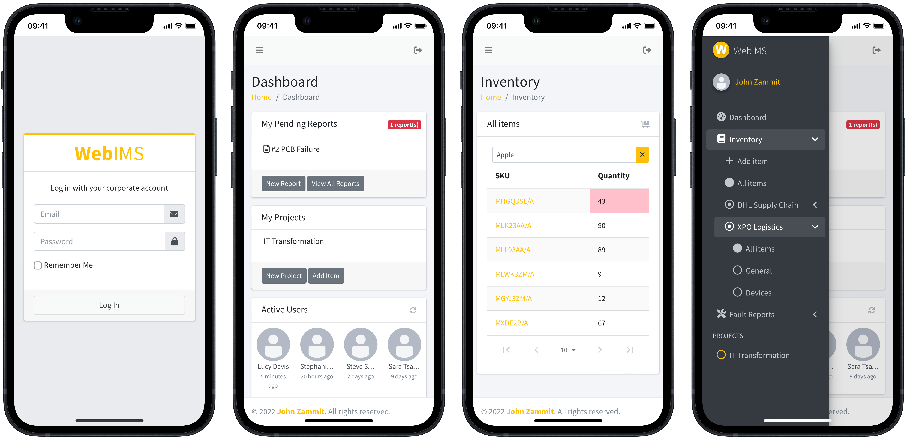

# webims-frontend
WebIMS is a modern web-based inventory, fault report and warehouse management solution. WebIMS allows you to stay on top of your inventory levels and value across multiple locations, as well as multiple projects. The interface makes it easy to search and filter your inventory and to assess the state of your current stock. It also facilitates tracking of item fault report progresses for better recordkeeping.

Key features:
- Project allocations and item registration
- Easy table view sorting and filtering
- Batch comma-separated values (CSV) file imports
- Transaction recording and database accounting functions 
- Multi-warehouse management
- Convenient fault reporting options

webims-frontend is built using React. The design is based on AdminLTE.io, a fully responsive Bootstrap template, fits many screen resolutions from small mobile devices to large desktops. webims-frontend uses the powerful [webims-backend-api](https://github.com/zammitjohn/webims-backend-api).

## Documentation
- [Creating a Production Build](docs/production_build.md)

## Image Credits
Icon adopted from [Freepik via Flaticon](https://www.flaticon.com/authors/freepik)